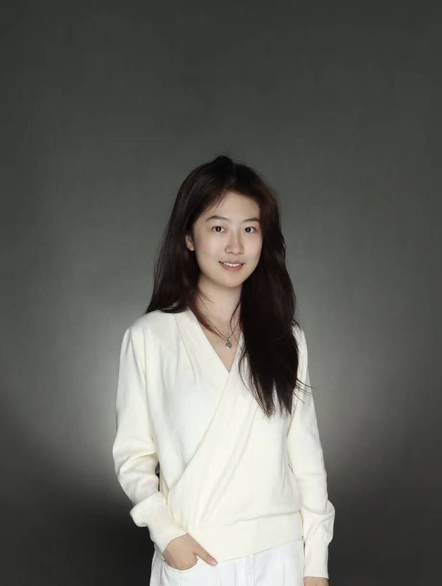
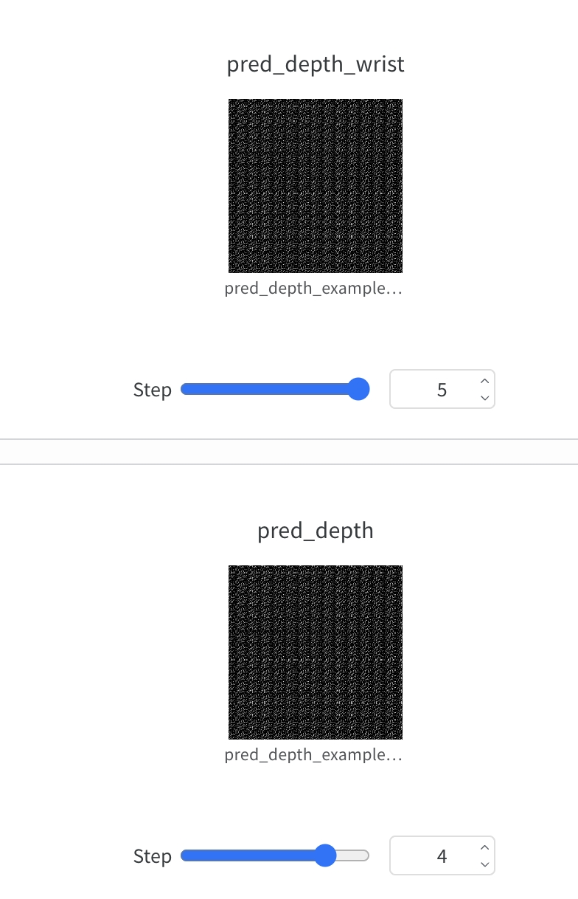
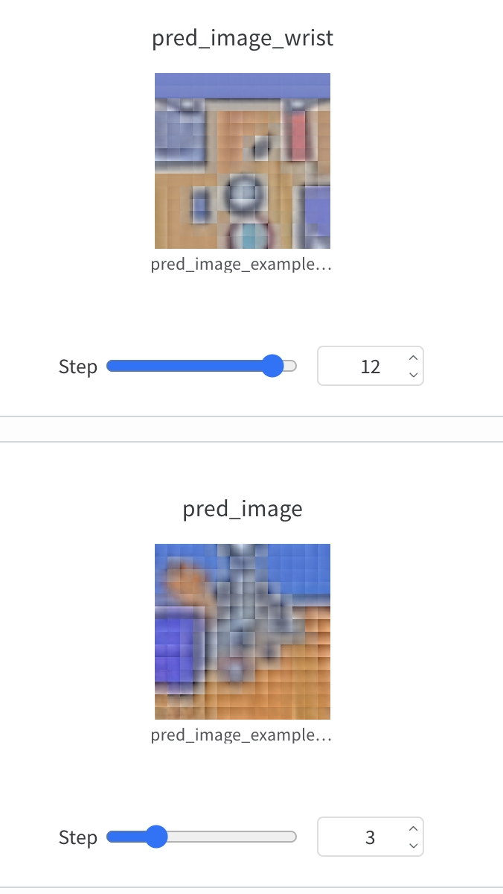
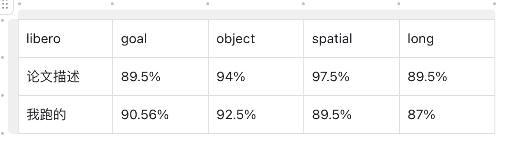
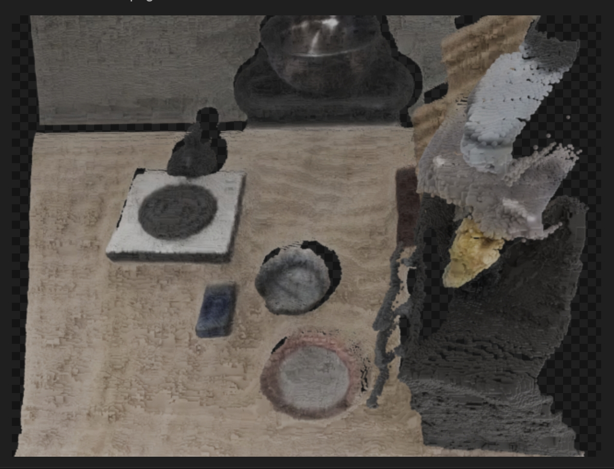
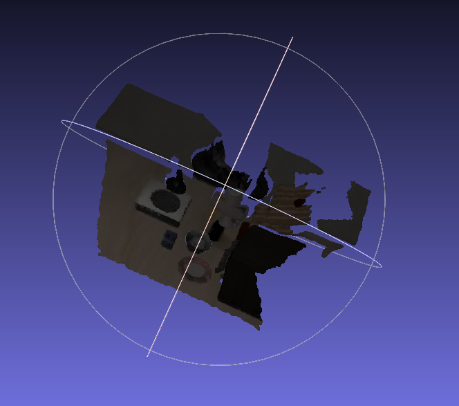
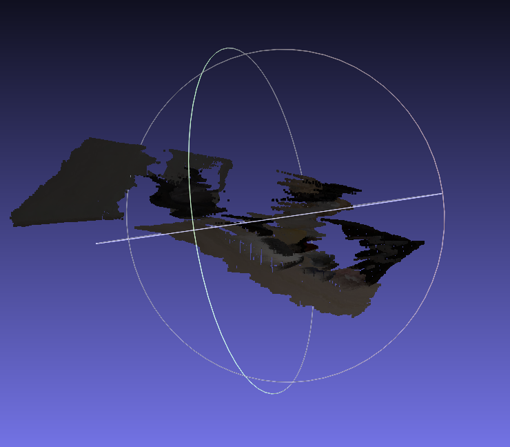
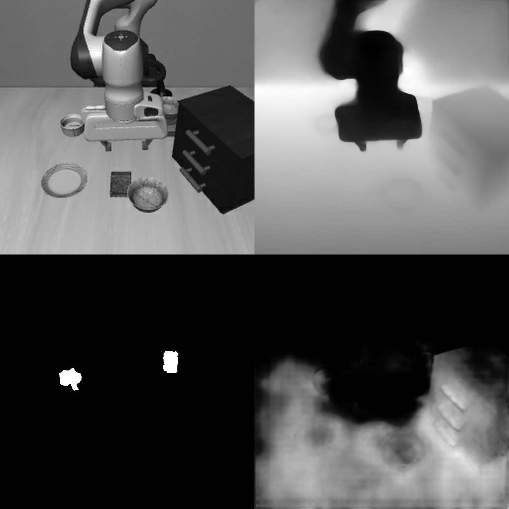
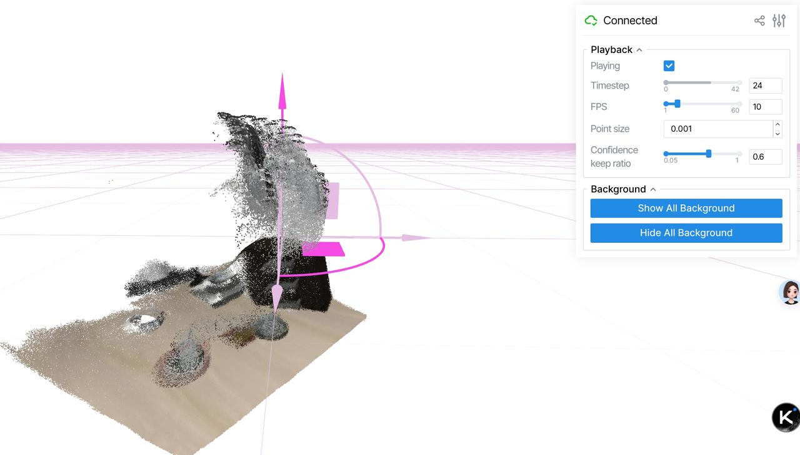

<!-- Language Toggle -->
<a href="#english-version">English</a> | <a href="#chinese-version">中文</a>

---

---

# 👋 Hi, I'm Li Xiaotong (李晓彤)

**Sophomore @ Southern University of Science and Technology (SUSTech)**
School of Automation and Intelligent Manufacturing · GPA 3.82

📧 [12412457@mail.sustech.edu.cn](mailto:12412457@mail.sustech.edu.cn) · 📍 Shenzhen, China

---

## 🎓 About Me

I am a sophomore student in the School of Automation and Intelligent Manufacturing at SUSTech, passionate about **Embodied AI**, **Robot Learning**, and **Multimodal Large Models**. I enjoy reproducing state-of-the-art papers and exploring deep learning systems from the ground up.

- 🔬 Research intern at **Liu Quanying's Neural Computing & Control Lab** (SUSTech), working on EEG-based drug addiction subtype classification via contrastive learning (Provincial "Climbing Plan" Project).
- 🧠 Summer research intern at **Brain & Intelligence Lab, Tsinghua University**, focusing on music therapy for depression/anxiety patients using EEG.
- 🤖 Passionate about VLA (Vision-Language-Action) models, 3D scene understanding, and robot manipulation.

---

## 🛠️ Skills

| Category | Details |
|---|---|
| **Programming** | Python · Java · PyTorch |
| **ML/DL** | Transformer architecture · LLM training optimization (CS336) · Multimodal inference |
| **Robotics** | IsaacLab / MuJoCo simulation · RLinf inference framework · 6-DOF robot arm control |
| **DevOps** | Linux · Git · AutoDL cloud platform · Virtual environment management |
| **Profiling** | Multimodal model inference optimization · Performance profiling |

---

## 📊 Language Scores

| Exam | Score |
|---|---|
| College Entrance English | 144 / 150 |
| CET-4 | 652 |
| TOEFL | 97 |

---

## 🔬 Reproduced Works

> The following are state-of-the-art papers I have personally reproduced and explored.

### 🦾 DreamVLA
> **DreamVLA** is a vision-language-action model that integrates world model imagination (image & depth prediction) into robot manipulation policy learning.

<table>
<tr>
<td> Depth Prediction</td>
<td> Image Prediction</td>
<td> Reproduction Results</td>
</tr>
</table>

---

### 🏺 Tesseract (3D Perception + Robot Manipulation)
> **Tesseract** leverages stereo depth estimation and 3D scene reconstruction to enhance robot policy learning with rich spatial representations.

<table>
<tr>
<td> 3D Scene Reconstruction</td>
<td> Primary Depth Map</td>
<td> Wrist Depth Map</td>
</tr>
</table>

**Rollout videos:**

| Task | Video |
|---|---|
| Put bottle on rack | [▶ put_the_bottle_on_the_rack.mp4](tesseract/put_the_bottle_on_the_rack.mp4) |
| Turn on the stove | [▶ val_0_turn_on_the_stove_0.mp4](tesseract/val_0_turn_on_the_stove_0.mp4) |

---

### 🌐 VGGT (Visual Geometry Grounded Transformer)
> **VGGT** is a feed-forward model for all-in-one 3D scene understanding: camera poses, depth maps, point clouds, and more — in a single forward pass.

<table>
<tr>
<td> VGGT Overview</td>
<td> Point Cloud Reconstruction</td>
</tr>
</table>

---

### 🤖 OpenVLA (Open-Source Vision-Language-Action Model)
> **OpenVLA** is an open-source VLA model for general-purpose robot manipulation, fine-tuned from a large vision-language model.

**Rollout video:**

[▶ openvla/0_副本.mp4](openvla/0_副本.mp4)

---

## 🏆 Awards & Activities

- 🥇 **2025 Guangdong Provincial "Climbing Plan" Innovation Fund** — EEG-based Addiction Subtype & Withdrawal Research via Contrastive Learning
- 🎓 **Outstanding Graduate** — Shenzhen Senior High School (Junior Division)
- ☕ **President, SUSTech Coffee Club (2024)** — Organized club, campus, and inter-university events

---

*Feel free to reach out for collaboration or research discussions!*

---
---

# 👋 你好，我是李晓彤

**南方科技大学 自动化与智能制造学院 · 大二在读 · GPA 3.82**

📧 [12412457@mail.sustech.edu.cn](mailto:12412457@mail.sustech.edu.cn) · 📍 深圳

---

## 🎓 关于我

我是南方科技大学自动化与智能制造学院的大二学生，对**具身智能**、**机器人学习**和**多模态大模型**充满热情。我喜欢复现前沿论文，并深入探究深度学习系统底层原理。

- 🔬 在**南科大刘泉影神经计算与控制实验室**参与省级"攀登计划"项目——主要负责基于对比学习的脑电数据在药物成瘾亚型分类与戒断研究中的数据预处理、特征提取、可视化分析及统计检验。
- 🧠 在**清华大学脑与智能实验室**暑研，研究抑郁焦虑患者的音乐治疗，负责实验设计、程序调试、被试招募与数据采集分析。
- 🤖 关注 VLA（视觉-语言-动作）模型、3D 场景理解与机器人操作。

---

## 🛠️ 专业技能

| 类别 | 详情 |
|---|---|
| **编程语言** | Python · Java · PyTorch |
| **机器学习** | Transformer 架构底层原理 · 大模型训练优化（CS336 体系）· 多模态模型推理性能优化与 Profiling |
| **机器人** | IsaacLab / MuJoCo 仿真 · RLinf 推理框架 · 6 自由度机械臂参数化控制 |
| **工程能力** | Linux 环境配置 · Git 版本控制 · AutoDL 云算力平台 · 虚拟环境管理 |

---

## 📊 语言成绩

| 考试 | 成绩 |
|---|---|
| 高考英语 | 144 分 |
| 大学英语四级（CET-4） | 652 分 |
| 托福（TOEFL） | 97 分 |

---

## 🔬 复现工作

> 以下是我个人独立复现的前沿论文工作。

### 🦾 DreamVLA
> **DreamVLA** 是一种将世界模型想象（图像与深度预测）融入机器人操作策略学习的视觉-语言-动作模型。

<table>
<tr>
<td> 深度预测</td>
<td> 图像预测</td>
<td> 复现结果</td>
</tr>
</table>

---

### 🏺 Tesseract（3D 感知 + 机器人操作）
> **Tesseract** 利用立体深度估计和 3D 场景重建，为机器人策略学习提供丰富的空间表征。

<table>
<tr>
<td> 3D 场景重建</td>
<td> 主视角深度图</td>
<td> 腕部视角深度图</td>
</tr>
</table>

**机器人执行视频：**

| 任务 | 视频 |
|---|---|
| 把瓶子放到架子上 | [▶ put_the_bottle_on_the_rack.mp4](tesseract/put_the_bottle_on_the_rack.mp4) |
| 打开炉灶 | [▶ val_0_turn_on_the_stove_0.mp4](tesseract/val_0_turn_on_the_stove_0.mp4) |

---

### 🌐 VGGT（视觉几何基础 Transformer）
> **VGGT** 是一种前向传播模型，单次前向即可完成相机姿态估计、深度图预测、点云重建等全套 3D 场景理解任务。

<table>
<tr>
<td> VGGT 概览</td>
<td> 点云重建</td>
</tr>
</table>

---

### 🤖 OpenVLA（开源视觉-语言-动作模型）
> **OpenVLA** 是面向通用机器人操作的开源 VLA 模型，基于大型视觉语言模型微调而来。

**机器人执行视频：**

[▶ openvla/0_副本.mp4](openvla/0_副本.mp4)

---

## 🏆 获奖与学生工作

- 🥇 **2025 年广东省科技创新"攀登计划"专项资金** — 对比学习脑电成瘾亚型分类与戒断研究
- 🎓 **深圳高级中学初中部优秀毕业生**
- ☕ **南科大咖啡社社长（2024）** — 组织社内、校级及校际活动

---

*欢迎交流合作与学术讨论！*

